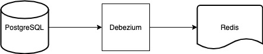

### Debezium Embedded



This repo is a demo for debezium embedded. Debezium Engine apis are used.

##### Prerequisites

- Docker for PostgreSQL and Redis
- Java 8
- Apache Maven


### Table

```
create table author
(
    id      bigint not null
        constraint author_pkey
            primary key,
    email   varchar(255),
    name    varchar(255),
    surname varchar(255)
);

alter table author
    owner to postgres;
```

### Creating the environment 

run `docker-compose up`

### Blogpost

https://www.kloia.com/blog/implementing-datasync-with-debezium-by-leveraging-outbox-pattern
